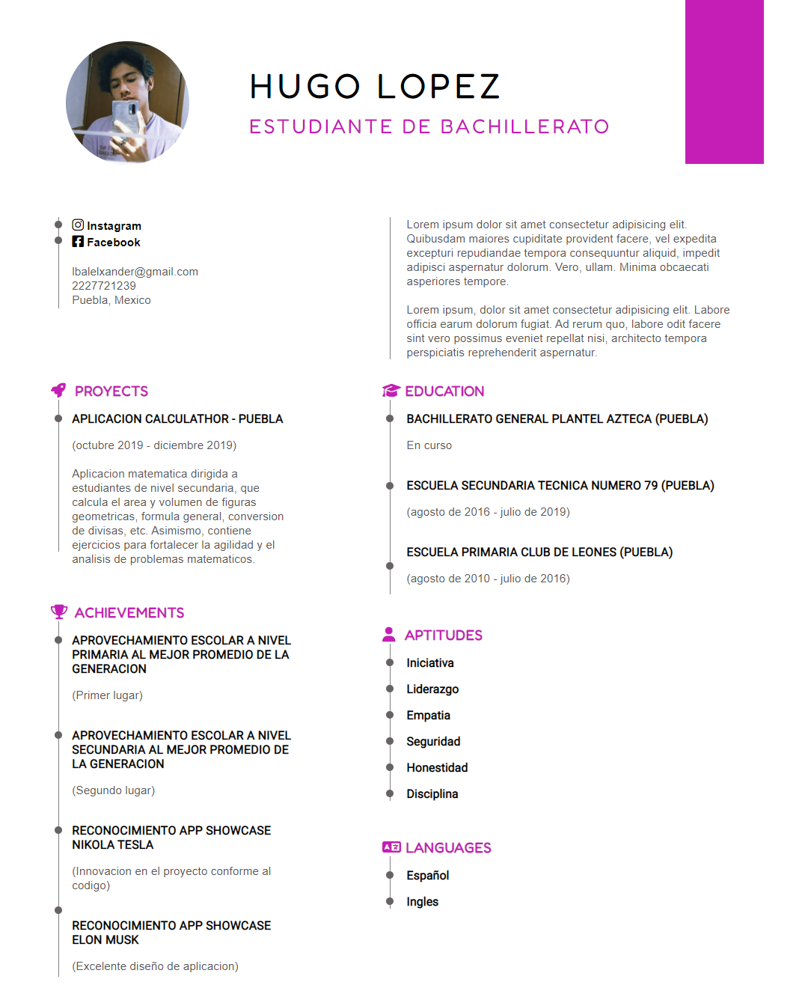

# Dev.f - Mi primer CV en web

This is a solution to the project ✨ Tu primer CV en web ✨ of the [Kata Intro a la web (dev.f)](https://www.devf.la/master/encoding/mx).
[Dev.f](https://www.devf.la/) offers an innovative solution to educational inclusion with EdTech programs that help people become software developers and obtain technological skills in order to obtain high-quality job opportunities in an agile and accessible way. 

## Table of contents

- [Overview](#overview)
  - [The challenge](#the-challenge)
  - [Screenshot](#screenshot)
  - [Links](#links)
- [My process](#my-process)
  - [Built with](#built-with)
- [Author](#author)

## Overview

### The challenge

- Create the first version of your CV.

### Screenshot

### Links

- GitHub Repository: [curriculum-vitae-github](https://github.com/Alelsito/curriculum-vitae)
- Live Site URL: [curriculum-vitae-hugo-netlify](https://curriculum-vitae-hugo.netlify.app/)

## My process

### Built with

- HTML
- CSS
- CSS Float

## Author

- Github - [@Alelsito](https://github.com/Alelsito)
